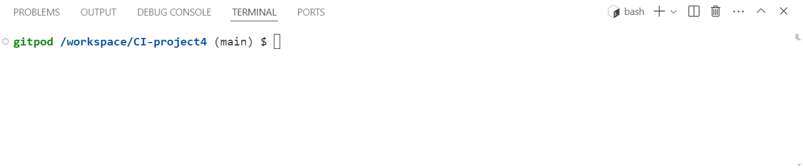
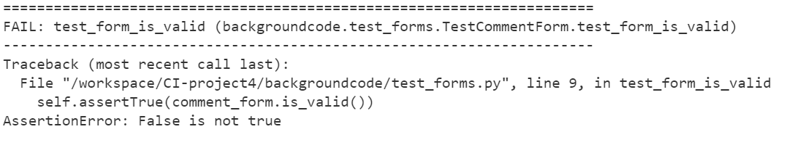
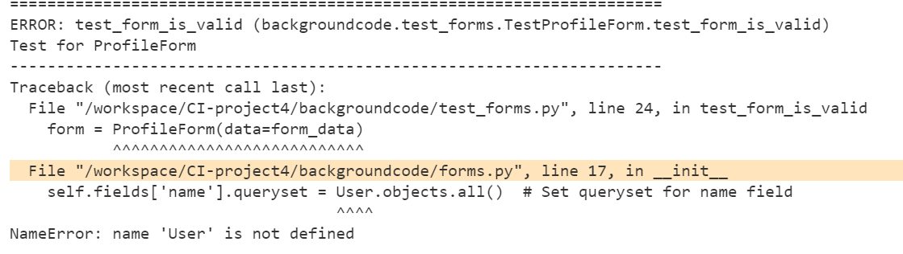
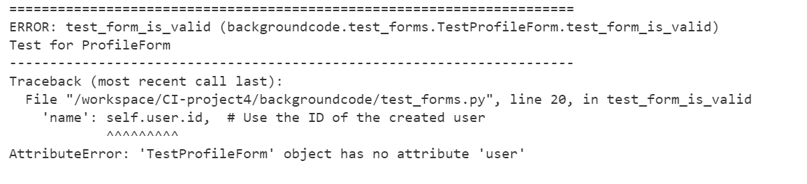
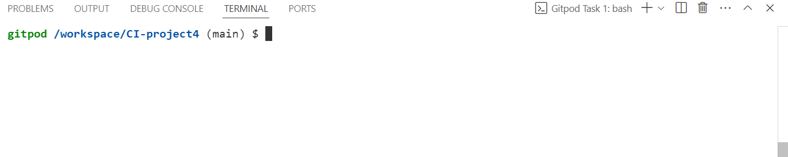
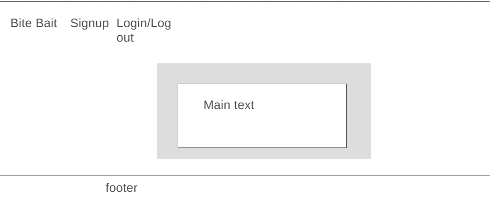
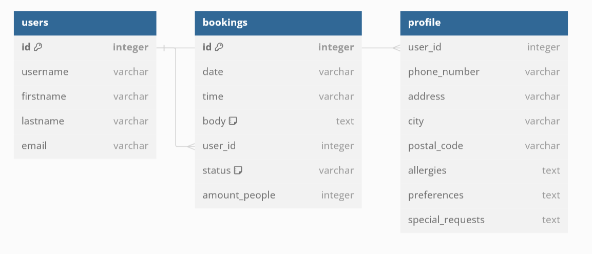

# CI-project4

Welcome to bite bait. A website designed to act as a booking system for a restaurant called bite bait.

View bite bait [here!](https://ci-project4-django-c7dcfccbb88c.herokuapp.com/)

## contents
1. [Unfinished parts](#unfinished-parts)
2. [Resubmission details](#resubmission-details)
3. [Features](#features)
4. [Installation](#installation)
5. [Usage](#usage)
6. [Code Structure](#structure)
7. [UX](#ux)
8. [Testing](#testing)
9. [Bugs](#bugs)
10. [Deployment](#deployment)
11. [User Stories](#user-stories)
12. [Design](#design)
13. [Sources and credits](#sources-and-credits)
14. [Contributing](#contribute)
15. [Contact](#contact)
## Please note
There was a personal CI Database issue with connecting my application to the CI database issue which started again on the 16/07/2024 and there was not enough time to debug and fix the issue (This Was out of my control!) So i want you to bare this in mind when you assess this project incase it goes again while you are assessing it :D
Yes the base.html file was ran through the html validator and there was errors but i wouldn't have enough time to fix and document them before submission.
I also want the assessment team to know that i have done as much as i can, because the submission deadline of the 21st i am working 9-7. The 19th and 20th i am also working so i only have today the 18th of july to submit this application.
## unfinished parts
This section is to talk about the parts of bite bait i have built but not had time to test as well as link back to the main part.
The main parts that i have not had enough time to add are the deleting bookings as well as editing bookings and deleting account details.
all of the main forms are done but the signup form does not send data to the /admin site
The Styling on the logout, page is not done as i would not have enough time. (booking styles is part done)
I have a little bit of code done for the automated testing as seen in backgroundcode/test_forms.py but i don't have enough code done for the tests.py files and also because the CI database was being faulty.
signup styling is not loading and after you click submit, it just shows with "{"success": true}" rather than a popup with "booking successful".
## Resubmission details
This section details the resubmission requirements and what i have done to fufil these.
**1.1** this is saying add more UX design requirements.
    - Bite bait asked me to keep the UX simplistic as that is what their restaurants are.

**1.3** This is saying to store and manipulate data
    - This is possible but i have to split my time between this project and another project due 10 days after resubmission on 13/10/2024

**1.13** This is saying to add the design process into the readme file
    - added into readme file

**2.2 and 2.3** This is saying to finish the CRUD development
    - finished Delete of CRUD
    - Finished update of CRUD
**3.1** Fix all bugs
    - Fixed bug which does not make a page styled
    - fixed bugs which causes broken links
**3.3** Refer to the 2.2 and 2.3
**4** Testing
    - Add more tests such as manual testing browser testing etc
    - Added different tests for different html files
**6.3** This is saying to expand deployment part of readme
    - Expanded deployment part of readme file

## Features
This section talks about the future features and features i have not had a chance to implement.
### Future features
Some of the potential future features i would like to include:
 - Ability to cancel reservations
 - Ability to add extra information i.e. allergies, dietry requirements etc.
 - Ability to see the menu of bite bait
 - Ability to edit the booking (change amount of guests or time)
 - Ability to delete their account
### unadded features
Some of the unadded features i have not had enough time to implement:
- Styling for logout
- Styling for signup
- Confirmation popup for when user made a booking
## Installation
- This section details the basic views of how to install the different parts of the application such as django, gunicorn and the PostgresSQL database.
### Install Django
- To install Django, you first have to open your IDE (this will be shown in gitpod)
- Then you click on the [terminal](backgroundcode/static/backgroundcode/images/terminal.png)
    - or you click on the 3 bars in the top left hand of the screen
    - Then you click on terminal
    - finally new terminal
- Once you are in the terminal you type "pip3 install Djang~=4.2.1"
- Click enter then you will have Django installed
### Install PostgresSQL Database
**This is for current Code institute Students only!**
- The Postgres database can be installed for Code Institute Students only by heading to this [link](https://dbs.ci-dbs.net/)
- Then inputting the email you use to sign into the LMS (Dashboard) on Code Institute (CI)
- Then you should recieve an email saying the database is created as well as the details for it
- Finally you can add it to your project the same way as when ElephantSQL was working
### Install packages
 - To install the required packages you open the terminal
 
 - Then you type pip3 install <Name> (<name> is name of package)
 - If you need a required version you can type in the version after the name of the package (Like 20.1.0 for gunicorn)
## Usage
To make a booking,
1. Open the website
2. if you have not already you should sign in or signup
3. If you have already signed in you click on create booking
4. You then enter your details,
5. You then click submit
6. You should see a popup to say "Booking made!"
## Code Structure
- This section details as to how the code is structured and how to get this structure.
### Make structure
- To make this Structure, you first have to install [Django](#installation)
    - Then you type into the terminal "pip3 freeze local > requirements.txt"
- After that you type into the terminal "django-admin startproject codestar ." (Replace codestar with the name of your project)
- You then create the new app by typing into the terminal "python3 manage.py startapp blog"
- Then under codestar (the project name) you open up settings.py
    - Then you append 'blog', into the bottom of the installed apps list
    - Afterwards in views.py you need to type in "from django.http import HttpResponse" then "def my_blog(request): return HttpResponse("Hello, Blog!")" This is used as a test to make sure the project works.
    - In codestar/urls.py, you then have to type "from blog.views import my_blog"
    - There should be a bit of the urls.py called urlpatterns, in there you append "path('blog/', my_blog, name='blog'),"
- Then you can check the project runs by typing "python manage.py runserver"
    - open the preview in a new tab then append /blog to the end of the url
- If you have completed all of the above, then you should see "Hello, Blog!" on your screen.
### How code is structured
This list is an example of what the applications file structure should look like.
CI-Project-name/
    codestar/
        __init__.py
        settings.py
        urls.py
        wsgi.py
        asgi.py
    blog/
        migrations/
            __init__.py
        __init__.py
        admin.py
        apps.py
        models.py
        tests.py
        views.py
    requirements.txt
    manage.py
Here is a brief overview of each part
- **manage.py**: A command-line utility that lets you interact with this Django project.
- **codestar/**: The project directory containing the project settings and configuration files.
  - **__init__.py**: An empty file that tells Python that this directory should be considered a package.
  - **settings.py**: The settings/configuration for this Django project.
  - **urls.py**: The URL declarations for this Django project; a "table of contents" of your Django-powered site.
  - **wsgi.py**: An entry-point for WSGI-compatible web servers to serve your project.
  - **asgi.py**: An entry-point for ASGI-compatible web servers to serve your project.
- **blog/**: The application directory.
  - **migrations/**: A directory that will store database migrations for this app.
  - **__init__.py**: An empty file that tells Python that this directory should be considered a package.
  - **admin.py**: A file to register models for the Django admin.
  - **apps.py**: A file that contains the configuration for the app.
  - **models.py**: A file to define the data models of the application.
  - **tests.py**: A file to define tests for the application.
  - **views.py**: A file to define views for the application.
- **requirements.txt**: A file listing the dependencies of the project.
## UX
This section tells us what the goals for bite bait are.
### Site Goals
Bite bait wants to attract users to be able to book a reservation at their restaurant with the potential addition of a menu to be available aswell in due course.
## Testing
 This Section is all about the testing of Bite bait. From testing that they work on different browsers to manual and automated testing.
### Browser testing
Bite Bait has been extensively tested on various web browsers including edge, chrome, safari, firefox
| Browser | Layout + Functionality |
|---------|------------------------|
| Chrome  | ✔                      |
| Firefox | ✔                      |
| Safari  | ✔                      |
| Ecosia  | ✔                      |
| Edge    | ✔                      |
### Validation Testing
This subsection talks about the different test validators and if the code passed through that fine.
I know that not all of the files are tested but i wanted to make sure that there at least was some testing done (manual, validation and automated)
#### HTML Testing

These images are for the base.html file (This caused an error) which when corrected make a different load of error messages appearing.
#### CSS Testing
CSS testing passed first time with no errors given

### Manual Testing
- checked for login to work (Before 14/07/2024 CI database error)
- Checked for site to load (Before 14/07/2024 CI database error)
### Automated Testing
The test cases are all based from the 'I think therefore i blog' module on the CI LMS (learning management system)
The 3 tests that are ran came back with originally 2 errors... then it went to 3 then back to 2 but currently as of 17:35 on 17/07/2024, it is down to 1 error.

- Test image 1 = the fix for this was to replace self.assertTrue with self.assertFalse

- Test image 2 = the fix for this was to just get rid of the line causing the test to fail
- Test image 3 = the fix for this was to also get rid of the line causing the test to fail

## Bugs
 This section is all about the annoying bugs which i either did fix or i did not have enough time to fix.
### Unfixed Bugs
No major bugs encountered but a bug which is annoying is that once i press the submit button after filling the details in the booking page, it then shows a blank screen with some JSON text.

The other minor bug is that the styling for the signout page is in style.css but does not want to show like the other pages.
### Fixed Bugs
 - At the very start of building this site for bite bait, i kept on encountering an error 500 as i was following along with the "i think therefore i blog" module on the Code Institute LMS which was caused by me forgetting to rename a part of one of the files to match up with bite bait.
 - i also encountered an internal server error on heroku which i checked the heroku dashboard, it came up in heroku logs that i had a h10 error (app crashed!). I used this youtube link and it helped fix the h10 and internal server [error.](https://youtu.be/68iCwSmSIvA?si=o3vwrcSVMWwiU9Xl)
 - Recently there was an error 403 when i appended /admin in my browser which was caused by not having the local host preview in the CSRF_TRUSTED_ORIGINS section of my settings.py file which is now fixed
 - between the 14th and 15th of july 2024, there was an issue with the CI database crashed but it has now been resolved.
## Deployment
Bite Bait was deployed via Heroku following these steps:
1. Create requirements.txt.
    - Within your development site such as visual studio or VSCode or Gitpod right click in the project folder mine is CI-PROJECT-4.
    
1.5 Freeze the requirements.txt file
    - within the terminal type "pip3 freeze > requirements.txt"
    - Please note that when you type requirements.txt you should ensure that the file is spelt correctly in order for it to work.
2. Push to GitHub.
    - Click on the 
    
    - You then type without the quotes, "git add ."
    - Then you type "git commit -m <message>"
        - Note that <message> should be a brief couple of words to tell other developers what you are committing
    - Finally you type "git push"
3. Sign up/login to Heroku.
    - Open up your browser of choice (I use chrome)
    - In the search bar type "https://www.heroku.com/"
    - Then in the top right hand corner of the web page you can either click on Log in or sign up
3i. Sign up to heroku
    - click on the sign up button
    - then you fill out the form with name, email, country, base language (language being used the most) and role (for me the role was student)
    - open your email and click on the link to confirm
    - then create your password
    - then you can login
    - then click accept for the t&c's 
3ii. Login to heroku
    - If you have already got an account with heroku you can just input your username and password
    - Then just validate with the salesforce authenticator app and then go into step 4
3iii. Set up student pack (for Code institute students)
    **Please note that this section is only for CI students**
    - within the search bar type "https://www.heroku.com/github-students"
    - Then click on "Get the student offer"
    - If needed login to heroku as seen in step 3ii
    - Click verify with github
    - Then click "Authorize Heroku"
    - Then you add your payment details or validate them if you have already added them
    - Enter your details such as "Code Institute" for the school name
    - Read T&c's then click agree
    - Then a thank you message appears telling you it takes upwards of 24 hours to process the request
    - When confirmation email comes through, check the amount of credits shoud be $156.00
4. Create a new app.
    - Click on "Create new app"
    - Then you must make a name for the application (each name has to be unique)
    - Click on the drop down underneath to pick where this application will be located (for me its europe)
5. Set up configuration variables.
    - Click onto the settings tab
    - Scroll down to the config vars section
    - Then you add your required config vars
5.5 Add buildpacks
    - underneath the config vars section should be the buildpacks section
    - some projects will be needing these so click on add buildpack
    - add the required language from the buildpack selection
6. Connect GitHub repository.
    - navigate to the deploy tab
    - in the deployment section click on connect to github
    - confirm that you want to connect with your github account
    - Then you can search for the repository name.
    - Click connect to connect the repo to heroku
7. Choose deployment method (manual or automatic).
    - Manual means you have to deploy it every single time you do a git push
    - Automatic means you don't have to manually deploy it every single git push heroku does it for you.
    - My preference is automatic as it is quicker and so i don't have to worry about remembering it
8. Wait for Heroku to build the application.
    - There is not much you can do while you wait as it takes less than 5 minutes
    - Have a drink or grab a snack to enjoy.
9. Open the app and enjoy!
    - Just click on the button which says open app then you can enjoy bite baits website
## User Stories
This section is about making user stories and just in general talking about them.
### Make user stories
In order to make a user story we first must make a project board.
 - Firstly, head over to GitHub and create a new repository. (name it something like django-blog)
 - In your repository, click on the Projects tab and click Link a project, then select Create new project from the dropdown that appears.
 -  Select the Board template and then rename the new board by clicking on the project name. Finally click Create. (Give it a sensible name)
 - Click on Workflows in the options menu (...).
 - Choose Item added to project and then click Edit.
 - Click the issue, pull request dropdown and unselect pull request. This step defines the item added as an issue.
 - Set the value of an item in the project to Status: Todo. Then click Save and turn on workflow.
 - Exit the workflows menu.
 - From the options menu (...), open Settings.
 - This board is private by default. In Settings > Danger Zone, you can set visibility to Public.
    (Note this must be public in order to submit project **For CI Students**)
You can create a user story template if you have not before.
- Return to the blog repo and click on Settings.
- Create a user stories template just as we did in the Agile section of the course. Scroll to Features, and within Issues, click Set up templates.
- Choose to add a Custom template.
- Preview a custom issue template for edit.
- Click the pen icon to edit.
- Edit the custom template using the same boilerplate markdown we used previously.
    Give it a descriptive template name and briefly explain the purpose in About.
    (As a **role** I can **capability** so that **received benefit**
    - Acceptance criteria 1
    - Acceptance criteria 2
    - Acceptance criteria 3)
- Click Propose changes, then add a commit message and commit the changes.
Now that we have a project board set up, we can make the user stories.
 - Click on Issues then New issue.
 -  Click on Get started to use your user story template.
 - Use the user stories template and fill in the missing steps of the story.
    (Title - "View paginated list of posts".
    Content - "As a site user, I can view a paginated list of posts so that I can select which post I want to view."
    AC1 - "Given more than one post in the database, these multiple posts are listed."
    AC2 - "When a user opens the main page a list of posts is seen."
    AC3 - "Then the user sees all post titles with pagination to choose what to read.")
 -  On the right-hand side click on Projects, and then select your user stories project to add the story to.
 - Click Submit new issue.
 - Go to the Projects tab and click on the user stories Kanban board to see the user story in the Todo list.
 - Finally you repeat for all of the user stories that are needed.
### Talk about user stories
User stories are great to simplify and organise the tasks that are needed to be done for projects or different applications such as bite bait. They can however, take a chunk of project time away from development so in between future projects i would like to develop a script to help automate the creation of user stories in github projects.
## Design
Bite bait was designed as a booking system for a restaurant to streamline their booking process.
### UX Design
The UX design for Bite bait was intended to be simplistic as that's the style for their restaurants.
Coincidentally, their colour scheme was black and orange.
In future versions if needed, i will make sure that the colour scheme is something new.
I have also ensured that all pages are properly styled and are more responsive.
### Wireframe Design
The wireframe design was done via [wireframe.cc](https://wireframe.cc/)

### ERD Design
The Entity Relationship Design was done via [dbdiagram.io](https://dbdiagram.io/home)

To explain the image.
 - One user can have many bookings
 - One user can have many profiles (if they forget their email, lost their email etc.)
## Sources and Credits
 This section is all about the help i got from links, people, my mentor as well as the links to what i used to help my project.
### Sources
- The fonts were generated by google [fonts](https://fonts.google.com/)
- The main structure of the code was followed from Code Institutes I think therefore i blog module on their 5 project course.
- Code institutes github account who i checked my code with when i thought i missed a [step.](https://github.com/Code-Institute-Solutions/blog)
- Youtube for when i had an error 500 and a heroku h10 error.
    - h10 error [video!](https://youtu.be/68iCwSmSIvA?si=1ZuDBlHXPwnbr9Au)
- Unsplash for the main photo for [bite bait](https://unsplash.com/photos/brown-and-gray-concrete-store-nmpW_WwwVSc)
- CI 5 project 'i think therefore i blog' section 'User stories in github projects' module to help me explain how to make a user story.
### Credits
 - My mentor Spencer Barribal for always providing advice and improvements that i can add to Bite bait
 - One of my old college projects for being a reliable source of information and reminding me on how to do certain parts of the design (like the entity relationship diagrams) aswell as part of the development in python.
 - My fellow peers and friends for giving me the motivation to finish this project when i have suffered with imposter syndrome
 - John from the code institute Tutor team for helping me solve an issue with error 500.
 - Other coworkers/ residents where i work at supporting me in getting this project done
 - The Code Institute 'i think therefore i blog' module on the 5 project course to be able to get the structure of the application and the create user stories section of the readme file.
## Contributing
Contributions are welcome! If you would like to contribute to this project, please follow these steps:
 - when i say feature i mean what you are calling your branch (step 2), and what you are commiting aswell as pushing (steps 4 and 5)
1. Fork the repository.
2. Create a new branch (`git checkout -b feature/YourFeature`).
3. Make your changes.
4. Commit your changes (`git commit -m 'Add some feature'`).
5. Push to the branch (`git push origin feature/YourFeature`).
6. Open a pull request.
7. Wait for pull request to be looked at by me.
8. If its okay then i'll approve it but if there is any potential improvements then i'll comment on it.
## Contact
 - If you have any suggestions or questions then feel free to reach out
 [Github](https://www.github.com/creepersguitar)
 [LinkedIn](https://www.linkedin.com/in/george-small-055151204)